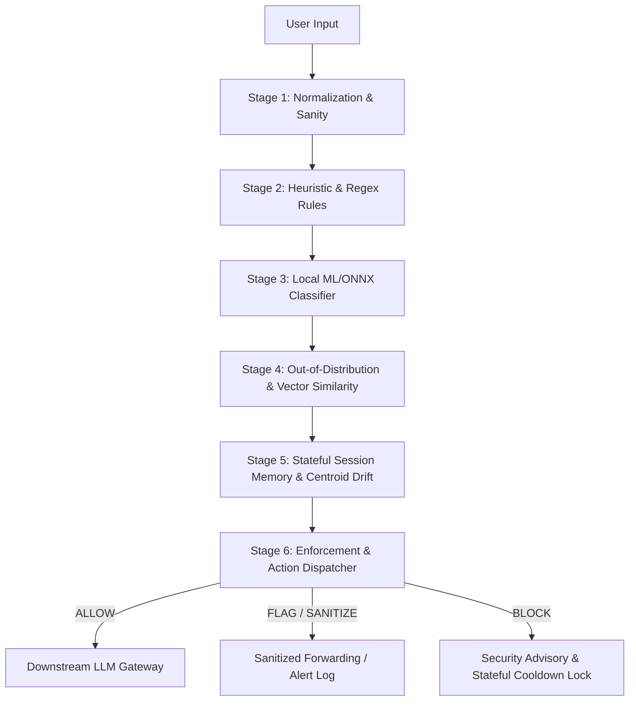

# SafeLLMKit Integration & Implementation Guide 🛡️

SafeLLMKit is a multi-layered, stateful AI Firewall and Guardrails SDK designed to intercept adversarial prompts, jailbreaks, PII leaks, and linguistic bypasses. It can be deployed on the JVM/Android backend, or directly in client-side web runtimes (React, Vue, Node.js).

This guide walks through the architectural pipeline, backend JVM setup (Kotlin/Java) with stateful Redis memory tracking, and client-side web integration.

---

## 📐 Architecture: The 6-Stage Firewall Pipeline

SafeLLMKit operates as a sequential mitigation pipeline, scanning and scoring inputs before dispatching them to downstream LLMs (like OpenAI, Anthropic, or OpenRouter):



1. **Stage 1: Normalization & Sanity** — Normalizes unicodes, resolves hidden characters, and checks basic constraints (e.g. length limits).
2. **Stage 2: Heuristic & Regex Rules** — Runs ultra-fast regex scanning for known exploit patterns, system instruction injections, and keyword bans.
3. **Stage 3: Local ML/ONNX Classifier** — Employs a local, lightweight binary classifier (`jailbreak_classifier.onnx`) running via ONNX Runtime to flag semantic intent.
4. **Stage 4: Out-of-Distribution (OOD) Similarity** — Measures prompt embedding distance against historical attack centroid embeddings using Mahalanobis distance thresholds.
5. **Stage 5: Stateful Session Memory & Centroid Drift** — Queries state history (via **Redis**) to monitor multi-turn semantic drift. Spikes in Centroid Drift identify slow, coordinated multi-turn alignment attacks (like *Crescendo*).
6. **Stage 6: Enforcement & Action Dispatcher** — Determines final action (`ALLOW`, `FLAG`/`SANITIZE`, `BLOCK`) based on cumulative threat risk scores ($R \in [0.0, 1.0]$) and locks out clients whose session reputation is compromised.

---

## ☕ 1. JVM/Android Backend SDK Integration

The core SDK resides in `safellmkit-core` (multiplatform) and `safellmkit-ml` (ONNX/machine learning runtimes).

### Installation (Gradle Setup)

Add the JitPack maven repository to your `settings.gradle.kts` (or root `build.gradle.kts`):

```kotlin
dependencyResolutionManagement {
    repositories {
        google()
        mavenCentral()
        maven { url = uri("https://jitpack.io") }
    }
}
```

Add dependencies to your application subproject `build.gradle.kts`:

```kotlin
dependencies {
    // Core Engine, Policies, and Memory Interfaces
    implementation("com.github.Aryan-Baglane.SafeLLMKit:safellmkit-core:v1.0.0")
    
    // ONNX Classification, Tokenizers, and OOD Mahalanobis Math
    implementation("com.github.Aryan-Baglane.SafeLLMKit:safellmkit-ml:v1.0.0")
}
```

---

### Stateful Redis Memory Setup (Multi-Turn Tracking)

To evaluate multi-turn threat correlation, SafeLLMKit requires a stateful storage gateway. By default, it uses `InMemoryConversationMemory`. For production, configure the Ktor-powered TCP socket-based `RedisConversationMemory` to track user reputation and block sessions.

```kotlin
import com.safellmkit.memory.RedisConversationMemory
import com.safellmkit.core.engine.InMemoryConversationMemory

// Instantiates Redis connection mapping keyspace "session:{sessionId}:state"
val redisMemoryGateway = RedisConversationMemory(
    host = "127.0.0.1",
    port = 6379,
    fallback = InMemoryConversationMemory() // Fallback gracefully if Redis is offline
)
```

---

### Initializing the Guardrails Agent (JVM / Ktor / Spring)

Load the classifier assets, set up the rules engine, and instantiate the `GuardrailsAgent`:

```kotlin
import com.safellmkit.core.*
import com.safellmkit.ml.onnx.OnnxRiskModel
import com.safellmkit.ml.tokenizer.Tokenizer

// 1. Initialize local ONNX classifier using local model file paths
val tokenizer = Tokenizer.loadDefault()
val onnxModel = OnnxRiskModel(
    modelPath = "/var/models/guardrail_model_int8.onnx",
    tokenizer = tokenizer
)

// 2. Define custom security policy rules
val enterprisePolicy = GuardrailsPolicy(
    inputRules = listOf(
        LengthRule(max = 4000),
        RegexRule(
            pattern = "(?i)ignore\\s+previous\\s+instructions",
            severity = 10,
            ruleName = "INSTRUCTION_BYPASS"
        ),
        RegexRule(
            pattern = "(?i)\\b(secret_key|api_token)\\b",
            severity = 9,
            ruleName = "PII_LEAK"
        )
    ),
    // Define OOD threat vector parameters (Mahalanobis centroid drift limit)
    centroidDriftThreshold = 0.70f 
)

// 3. Assemble GuardrailsEngine
val engine = GuardrailsEngine(
    policy = enterprisePolicy,
    memoryGateway = redisMemoryGateway
)

// 4. Initialize Core Protecting Agent
val agentConfig = GuardrailsAgentConfig(
    enableMlCheck = true,
    mlThreshold = 0.90f,
    blockOnMlJailbreak = true
)
val guardAgent = GuardrailsAgent(engine, onnxModel, agentConfig)
```

---

### Protecting Prompts & Managing Session Reputation

Wrap your API endpoints to validate incoming user requests before executing downstream prompts. 

When a prompt is blocked, client session reputation decays according to:
$$R(t) = R_0 + (1 - R_0) \times (1 - e^{-t/30})$$
Where $R_0$ is the reputation post-attack and $t$ is the elapsed recovery time in seconds.

```kotlin
import kotlinx.coroutines.runBlocking

fun handleUserPrompt(sessionId: String, userPrompt: String): String = runBlocking {
    // 1. Scan through the multi-stage filter
    val result = guardAgent.protectInput(sessionId, userPrompt)
    
    when (result.action) {
        GuardrailAction.BLOCK -> {
            // Drop client reputation and throw a security exception
            throw SecurityException("Security Advisory: Input blocked. Reason: ${result.findings.firstOrNull()?.message}")
        }
        GuardrailAction.SANITIZE -> {
            // Forward sanitized input to the LLM
            executeLlmGateway(result.sanitizedInput)
        }
        GuardrailAction.ALLOW -> {
            // Forward original prompt to the LLM
            executeLlmGateway(userPrompt)
        }
    }
}
```

---

## 🌐 2. JavaScript / TypeScript Browser Integration

For client-side applications (like React dashboards, chat applications, or next-generation browser extensions), use `safellmkit-js`.

### Installation

```bash
npm install safellmkit-js onnxruntime-web
```

*Note: ONNX Runtime Web utilizes WebAssembly (`.wasm`) to execute classification directly on the user's thread.*

---

### React Integration Hook Example

Create a reusable hook `useSafeLLMKit.ts` to manage loading, validation, and dashboard metrics:

```typescript
import { useState, useEffect, useRef } from 'react';
import { SafeLLMKit, OnnxClassifier, GuardrailAction } from 'safellmkit-js';

export function useSafeLLMKit(modelAssetPath = '/jailbreak_classifier.onnx') {
  const [isReady, setIsReady] = useState(false);
  const guardRef = useRef<SafeLLMKit | null>(null);

  useEffect(() => {
    const classifier = new OnnxClassifier(modelAssetPath);
    classifier.init().then(() => {
      guardRef.current = new SafeLLMKit([], classifier);
      setIsReady(true);
      console.log('SafeLLMKit: Browser ONNX Classifier Initialized.');
    }).catch(err => {
      console.error('Failed to initialize ONNX runtime:', err);
    });
  }, [modelAssetPath]);

  const scanPrompt = async (text: string) => {
    if (!guardRef.current || !isReady) {
      throw new Error('SafeLLMKit is not loaded yet.');
    }
    
    // Execute rule matches and WASM ONNX neural net evaluation
    const result = await guardRef.current.validateAsync(text);
    
    return {
      isBlocked: result.action === GuardrailAction.BLOCK,
      sanitized: result.sanitizedInput,
      riskScore: result.riskScore / 100, // Normalized to 0.0 - 1.0
      findings: result.findings
    };
  };

  return { isReady, scanPrompt };
}
```

---

### Component Integration Example

Use the hook within your React chat interface:

```tsx
import React, { useState } from 'react';
import { useSafeLLMKit } from './useSafeLLMKit';

export function ChatApp() {
  const { isReady, scanPrompt } = useSafeLLMKit();
  const [input, setInput] = useState('');
  const [chat, setChat] = useState<string[]>([]);
  const [statusMsg, setStatusMsg] = useState('');

  const handleSend = async () => {
    if (!input.trim()) return;
    setStatusMsg('Scanning...');

    try {
      const securityCheck = await scanPrompt(input);
      
      if (securityCheck.isBlocked) {
        setStatusMsg(`🚫 Blocked: Prompt contains security threat (${Math.round(securityCheck.riskScore * 100)}% risk).`);
        return;
      }
      
      // Pass sanitized or original text to your server API
      const response = await fetch('/api/chat', {
        method: 'POST',
        body: JSON.stringify({ message: securityCheck.sanitized })
      });
      const data = await response.json();
      
      setChat(prev => [...prev, `User: ${input}`, `AI: ${data.response}`]);
      setInput('');
      setStatusMsg('');
    } catch (e: any) {
      setStatusMsg(`Error: ${e.message}`);
    }
  };

  return (
    <div className="p-6 bg-slate-50 min-h-screen">
      <h2 className="text-xl font-bold mb-4">Protected Chat Gateway</h2>
      
      <div className="border border-slate-200 bg-white rounded-2xl p-4 h-64 overflow-y-auto mb-4">
        {chat.map((msg, i) => <div key={i} className="mb-2 text-sm">{msg}</div>)}
      </div>

      <div className="flex gap-2">
        <input 
          value={input} 
          onChange={e => setInput(e.target.value)} 
          disabled={!isReady}
          placeholder={isReady ? "Ask something..." : "Initializing WASM Engine..."}
          className="flex-1 px-4 py-2 border rounded-xl"
        />
        <button onClick={handleSend} disabled={!isReady} className="px-6 py-2 bg-indigo-600 text-white rounded-xl">
          Send
        </button>
      </div>
      {statusMsg && <p className="text-xs text-slate-500 mt-2">{statusMsg}</p>}
    </div>
  );
}
```

---

## 📊 Summary of Production Best Practices

1. **Layer Rules Before Models**: Always place Regex/Rule heuristics first in the policy list. They complete in sub-millisecond durations and immediately drop known adversarial vectors before running costly neural network inference.
2. **Dynamic Fallbacks**: Implement local fail-safe strategies. If your server is under resource exhaustion, configure the `GuardrailsAgentConfig` to bypass ONNX model execution and rely solely on structural rules.
3. **Session Partitioning**: Always scope Redis conversation centroids using both `userId` and `sessionId` as keys to isolate individual conversation paths and prevent memory leaks or inter-tenant state leakage.
